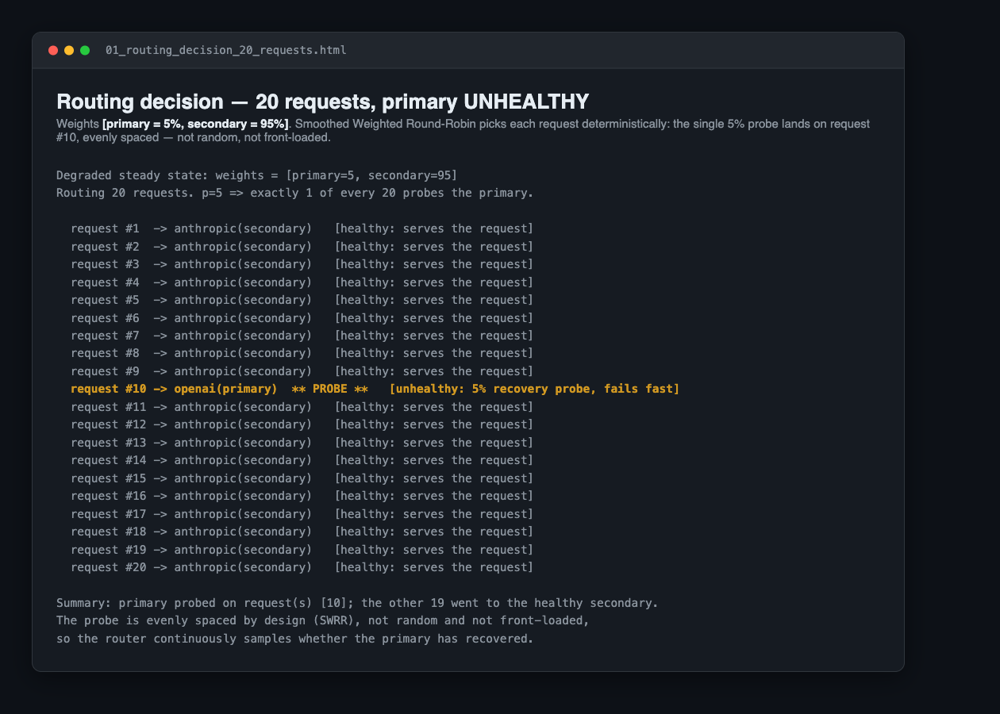
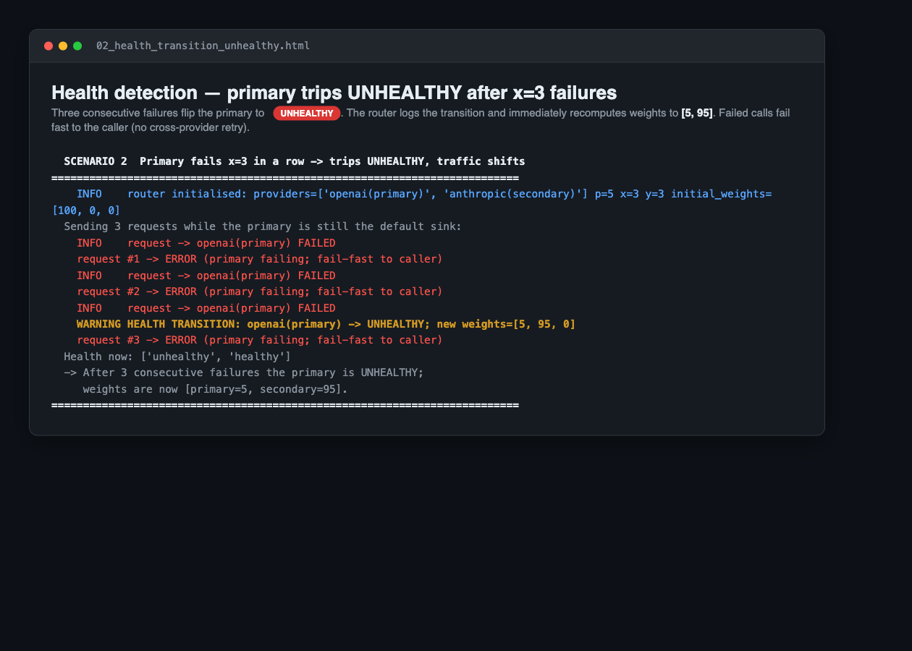
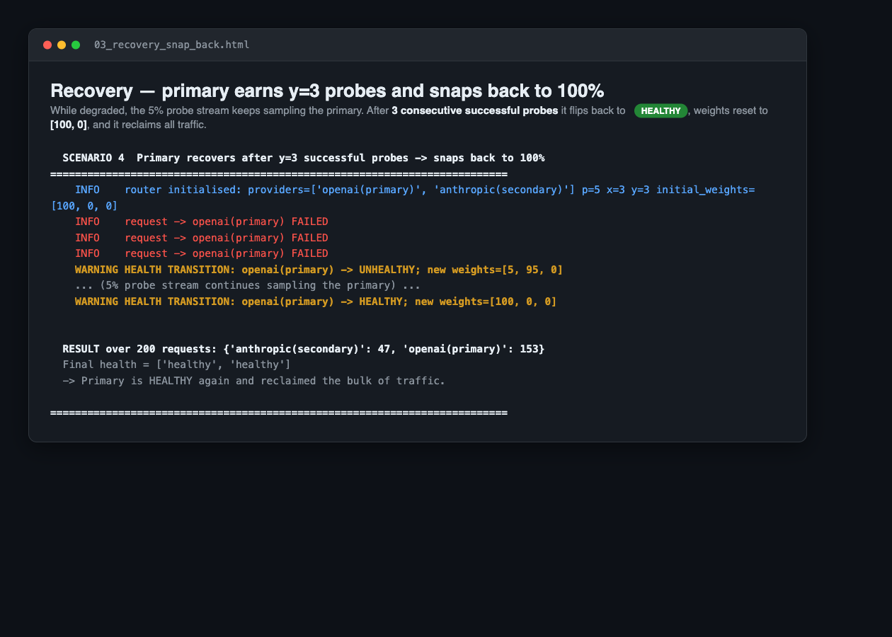
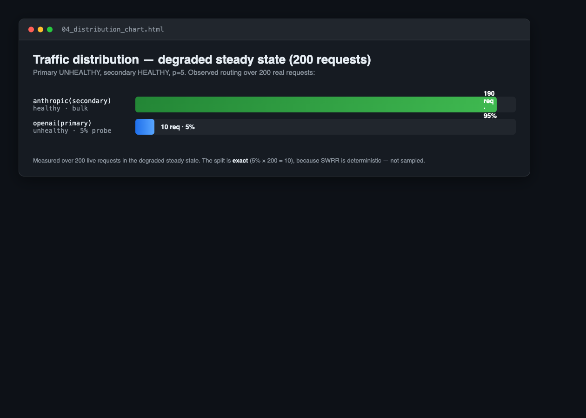

# Evidence — LLM Failover Router in action

Captured from live runs of `examples/demo.py` and `examples/trace_20.py` (p=5).

### 1. Routing decision — 20 requests, primary UNHEALTHY
Which of 20 incoming requests goes where. Weights `[primary=5%, secondary=95%]`;
the single 5% probe deterministically lands on request #10 (evenly spaced, not random).

### 2. Health detection — primary trips UNHEALTHY after x=3 failures
Three consecutive failures flip the primary to UNHEALTHY; the router logs the
transition and recomputes weights to `[5, 95]`. Failed calls fail fast to the caller.

### 3. Recovery — primary snaps back to 100%
The 5% probe stream keeps sampling the degraded primary. After y=3 consecutive
successful probes it flips back to HEALTHY and reclaims all traffic.

### 4. Traffic distribution — degraded steady state (200 requests)
Observed routing over 200 real requests: exactly 190 (95%) to secondary,
10 (5%) probes to primary. Exact because SWRR is deterministic.

